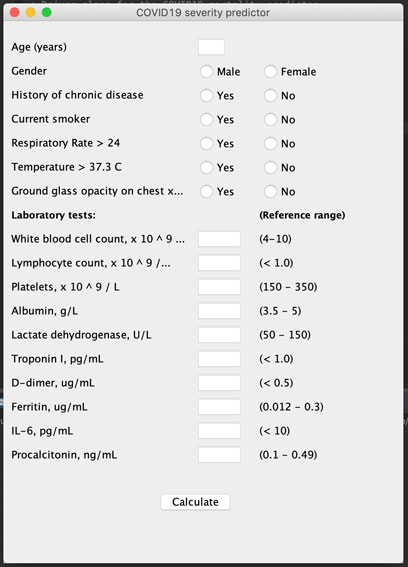
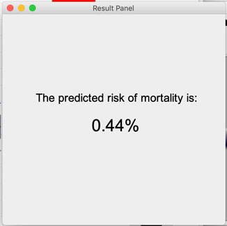

# COVID-19 SEVERITY PREDICTOR
### final-project-team_37_covid_19

### Project Description/Objectives (Here)

## How to run this application

To run this application, please follow the instructions below:

0. From the terminal/command line (or git bash), navigate to your preferred folder location and create a new directory called COVID: type `mkdir COVID` in the terminal and hit enter.
1. Type `cd COVID` and hit enter
2. Type `git init` and hit enter
3. Clone the covid project repo from the terminal by entering the following command `git clone git@github.com:UPenn-CIT599/final-project-team_37_covid_19.git` and hit enter.
4. Open up Eclipse IDE
5. To load the project, go to: File --> New --> Java Project
6. When the "New Java Project" dialog box opens, uncheck `Use default location` and hit `Browse`
7. Navigate into the COVID folder created in step 1 to see the `final-project-team_37_covid_19` subfolder. Select this subfolder and click `open`. Eclipse should load the project into your workspace.
8. Follow the steps below to load Weka and JFreeChart BEFORE running the program

To get Weka working on your local, Please download stable-3-8.zip from https://www.cs.waikato.ac.nz/ml/weka/snapshots/weka_snapshots.html

Unzip the file, add weka.jar to your library path of Java project in Eclipse following these instructions:

To import jar file in your Eclipse IDE, follow the steps given below.
- Right click on your project
- Select Build Path
- Click on Configure Build Path
- Click on Libraries and select Add External JARs
- Select the jar file from the required folder
- Click and Apply and Ok

Source:
https://www.edureka.co/community/4028/how-to-import-a-jar-file-in-eclipse

To enable the JFreeChart library, go to https://sourceforge.net/projects/jfreechart/files/
- Click the green "download latest version" button.
- Unzip the file, open the uncompressed file, navigate to the `lib` folder where you will find the `.jar` files. 
- Use the same steps outlined above (how to import weka.jar in to Eclipse IDE) to add both `jfreechart.jar` and `jcommon.jar` to the library path of your Java project in Eclipse.

9. In your Eclipse IDE workspace, under the Package Explorer tab, click the down arrow left of `final-project-team_37_covid_19` to access the drop-down list showing the folder content.
10. Click src --> default package --> `Runner.java` to open the Runner class.
11. Hit `Run` (Shift+Cmd+F11). The application should load. If it doesn't go over the steps above to be sure every step was carried out correctly.

12. The COVID 19 Severity Predictor dialog box should appear showing risk factors for covid mortality.

13. Please fill all fields-- numbers in the text input fields, and select radio buttons for each risk factor as appropriate.
14. Hit `calculate`
15. The application will return the patient mortality risk based on the inputs provided along with trend plots for important features on which the classifier (multilayer perceptron) was trained.

